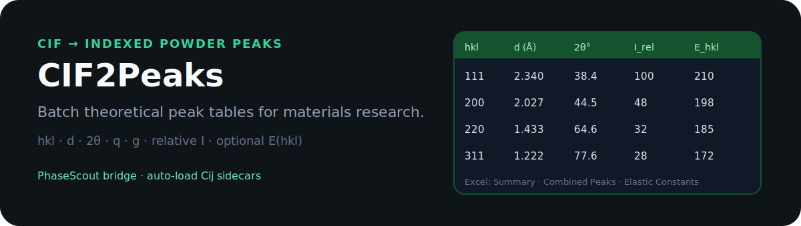

<p align="center">
  
</p>

# CIF2Peaks

**CIF → indexed theoretical powder peak tables for Excel, Origin, and Python.**

CIF2Peaks converts CIF crystal structures into batch-exportable peak reference tables: phase, hkl, d-spacing, 2θ, q, g, relative intensity, warnings, and optional hkl-normal Young’s modulus when Cij is available.

## Features

- One CIF, many CIFs, or a folder of CIFs
- Combined Excel workbook: `Summary`, `Combined Peaks`, `Elastic Constants`, one sheet per phase
- Desktop GUI with drag-and-drop; CLI for reproducible batches
- X-ray presets (`Cu Kα`, `30 keV`, `83 keV`) or manual energy
- **PhaseScout bridge:** auto-load `{stem}_elasticity.json` / `elasticity_index.csv` (default on)
- Continues when one CIF fails; errors land in `Summary`
- Multi-block CIF: selects the structural block

## Install

Python **3.11+**:

```powershell
cd C:\path\to\CIF2Peaks
py -3.11 -m pip install -e .[dev]
```

## GUI quick start

```powershell
cif2peaks-gui
# or: py -3.11 -m cif2peaks.gui
```

1. Drag `.cif` files or a folder, or use Add files / Add folder.
2. Choose X-ray preset or enter manual energy (keV). Manual energy wins when set.
3. Confirm d-range (Å) and output `.xlsx` path.
4. Click **Export Excel**.

### Windows users (no CLI)

```text
start_cif2peaks.bat
```

First run checks Python / Tk and installs dependencies when needed. Drag CIFs onto the bat or into the window. For export-only:

```text
quick_export_cif2peaks.bat
```

Portable build: `build_windows_app.bat` → `dist\CIF2Peaks_Windows_Portable.zip` (no Python on target PC).

## PhaseScout integration

PhaseScout batch folder:

```text
mp-23_Ni_FCC_….cif
mp-23_Ni_FCC_…_elasticity.json
elasticity_index.csv
Cij_PROVENANCE.txt
```

**GUI:** add/drag that directory → phases with valid sidecars show `[Cij]`.  
**CLI:** auto-elastic on by default:

```powershell
cif2peaks "D:\path\to\batch" -o hea_peaks.xlsx
# disable:  cif2peaks ... --no-auto-elastic
```

### Multiphase pairing (CIF → JSON)

| Priority | Rule |
|----------|------|
| 1 | Same folder `{exact_cif_stem}_elasticity.json` |
| 2 | Any `*_elasticity.json` whose `cif_filename` / `paired_cif` matches |
| 3 | Unique `material_id` (`mp-####`) in the CIF name |
| 4 | `elasticity_index.csv` row for that CIF name |

Prefer dragging the **whole** PhaseScout batch folder. Literature-only web packs are **not** loaded as numerical Cij. Loaded tensors use `materials_project_ieee_conventional`; check provenance for non-cubic phases. Invalid tensors leave moduli blank; peaks still export.

## CLI examples

```powershell
cif2peaks "C:\path\to\cif_folder" -o result.xlsx
cif2peaks phase1.cif phase2.cif -o result.xlsx
cif2peaks "C:\path\to\cif_folder" -o result.xlsx --energy-keV 20
cif2peaks "C:\path\to\cif_folder" -o result.xlsx --wavelength-A 1.5406
cif2peaks "C:\path\to\cif_folder" -o result.xlsx --source "Cu Ka" --two-theta-min 20 --two-theta-max 100
cif2peaks "C:\path\to\cif_folder" -o result.csv
```

## Output columns (peak tables)

Include among others: `phase_name`, `cif_name`, `formula`, `space_group`, `hkl`, `d_A`, `two_theta_current_deg`, `relative_intensity`, material scattering factors `R_hkl` (with/without LP), multiplicity/family fields, `q`/`g`, density/cell metadata, `warnings`, and when elastic data load: `young_modulus_hkl_normal_GPa`, `elastic_status`, family modulus notes.

## Scientific scope

Theoretical powder XRD peak **references** from CIF structures — not experimental fitting, not Rietveld, not a phase-ID database, not instrument calibration.

Material scattering factors for phase-fraction style workflows:

```text
R_hkl_with_LP = I_unscaled / V_cell^2
R_hkl_no_LP   = (I_unscaled / LP) / V_cell^2
I_unscaled ≈ p_hkl |F_hkl|^2 LP
```

- Use with-LP `R` for uncorrected experimental areas (pymatgen convention).
- Use no-LP `R` when pyFAI (or equivalent) already removed LP/geometry terms.
- If the reduction record does not prove LP handling, do not quantify phase fractions until logs are checked.
- Default temperature factor: `e^-2M = 1` when no reliable data; absorption, detector geometry, and synchrotron polarization are **not** included.
- Cij-based `young_modulus_hkl_normal_GPa` uses the supplied stiffness matrix and CIF lattice-derived plane normals — not an experimental modulus.

Prioritize `phase_name`, `hkl`, `d_A`, and `two_theta_current_deg` for peak-position work; treat relative intensity as theoretical only.

## Tests

```powershell
py -3.11 -m pytest -q
```

## License

MIT — see [LICENSE](LICENSE).
