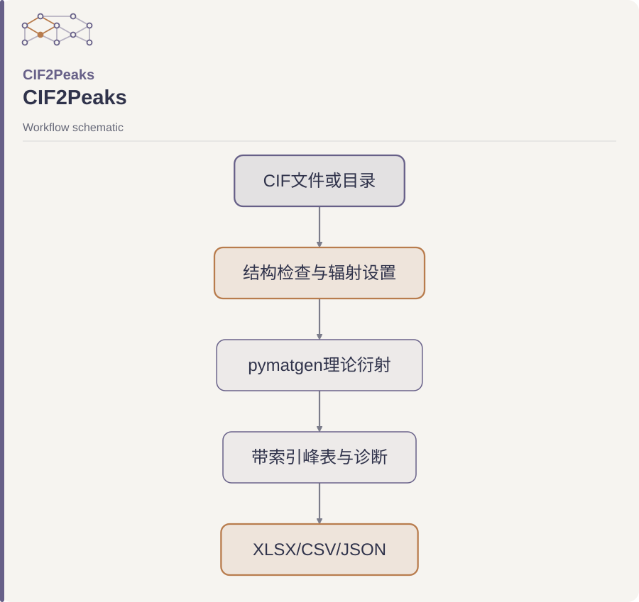

<p align="center">
  
</p>

# CIF2Peaks

**把 CIF 晶体结构转换成带晶面索引的理论粉末 XRD 峰表。**

Indexed theoretical powder peaks for materials researchers using Excel, Origin, or Python: phase, `hkl`, `d`, 2θ, `q`, `g`, relative intensity, diagnostics, and optional hkl-normal Young’s modulus from supplied `Cij`.

> **Archived / 已归档。** 源码与历史用法保留供查阅。当前 [DiffractScout 完整版](https://github.com/D-sudoasd/DiffractScout/blob/main/docs/REPLACEMENT_AUDIT.md)包含兼容工作台；计算引擎和强度结果仍应按对照文档区分。

[安装与 GUI](#install--quick-start) · [CLI](#cli) · [CIF 示例](examples/cif/) · [输出范围](#scientific-boundary--what-it-is-not)

[](LICENSE) [](pyproject.toml)

<picture>
  <source media="(max-width: 600px)" srcset="assets/readme/diagrams/workflow-readme-md-1-mobile.svg">
  
</picture>

<sub>[Editable diagram source / 可编辑图源](assets/readme/diagrams/workflow-readme-md-1.mmd)</sub>

默认 Excel 从“工作峰表”打开，同时保存结构表；多相时可生成指定重叠窗口的对照表。输出是结构模型的理论参考，需要结合实验标定和实际样品判断。

## Features

- Drag-and-drop CIF files/folders (Tk + tkinterdnd2)
- Beam presets: `Cu Kα` / `30 keV` / `83 keV`, or manual energy
- Configurable *d*-range; CSV or Excel export
- Optional auto-elastic bridge from PhaseScout packs (`*_elasticity.json` / `elasticity_index.csv`)
- Portable Windows build via `build_windows_app.bat`

## Install / Quick start

Python **3.11+**

```powershell
py -3.11 -m pip install -e ".[dev]"
cif2peaks-gui
# or: py -3.11 -m cif2peaks.gui
# Windows: start_cif2peaks.bat · quick_export_cif2peaks.bat · 启动CIF2Peaks.bat
# Quick export entry point after install: cif2peaks-quick-export
```

GUI flow: (1) drag CIF files/folders → (2) choose energy → (3) set *d*-range → (4) **Export Excel**.

## CLI

```powershell
cif2peaks "C:\path\to\cif_folder" -o result.xlsx
cif2peaks folder -o result.xlsx --energy-keV 20
cif2peaks folder -o result.csv
```

### PhaseScout bridge

```powershell
cif2peaks "D:\path\to\batch" -o hea_peaks.xlsx   # auto-elastic on
```

Pairs `{stem}_elasticity.json` / `elasticity_index.csv`. Literature-only packs are **not** numerical Cij.

## Scientific boundary — what it is NOT

<p align="center">
  
</p>

Theoretical peak **references** only — not experimental fitting, Rietveld / Le Bail / Pawley, phase-ID databases, or instrument calibration.

```text
R_hkl_with_LP = I_unscaled / V_cell^2
R_hkl_no_LP   = (I_unscaled / LP) / V_cell^2
```

Use the *R* column that matches experimental LP handling. Default `e^-2M = 1` when no temperature factors. Cij-based moduli are **not** experimental measurements.

## Tests & portable build

```powershell
py -3.11 -m pytest -q
```

Portable Windows build: `build_windows_app.bat` → `dist\CIF2Peaks_Windows_Portable.zip`

## License

MIT — [LICENSE](LICENSE). Author: D-sudoasd.
