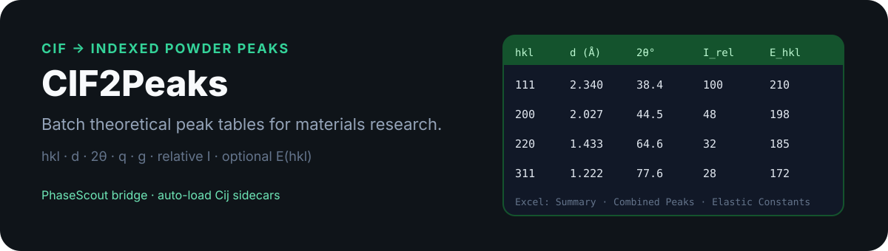

<p align="center">
  
</p>

# CIF2Peaks

**CIF → indexed theoretical powder peak tables for Excel, Origin, and Python.**

[](LICENSE)
[](https://www.python.org/downloads/)
[](pyproject.toml)

Batch-export phase, *hkl*, *d*, 2θ, *q*, *g*, relative intensity, structure warnings, and optional *hkl*-normal Young’s modulus when Cij is available.

The default Excel workbook opens on **工作峰表** and also writes **Structure**; for two or more phases it adds **Overlap** (stated Δ2θ / Δd window).

<p align="center">
  
</p>

## Features

- Drag-and-drop CIF files/folders (Tk + tkinterdnd2)
- Beam presets: `Cu Kα` / `30 keV` / `83 keV`, or manual energy
- Configurable *d*-range; CSV or Excel export
- Optional auto-elastic bridge from PhaseScout packs (`*_elasticity.json` / `elasticity_index.csv`)
- Portable Windows build via `build_windows_app.bat`

## Install / Quick start

Python **3.11+**

```powershell
py -3.11 -m pip install -e ".[dev]"
cif2peaks-gui
# or: py -3.11 -m cif2peaks.gui
# Windows: start_cif2peaks.bat · quick_export_cif2peaks.bat · 启动CIF2Peaks.bat
# Quick export entry point after install: cif2peaks-quick-export
```

GUI flow: (1) drag CIF files/folders → (2) choose energy → (3) set *d*-range → (4) **Export Excel**.

## CLI

```powershell
cif2peaks "C:\path\to\cif_folder" -o result.xlsx
cif2peaks folder -o result.xlsx --energy-keV 20
cif2peaks folder -o result.csv
```

### PhaseScout bridge

```powershell
cif2peaks "D:\path\to\batch" -o hea_peaks.xlsx   # auto-elastic on
```

Pairs `{stem}_elasticity.json` / `elasticity_index.csv`. Literature-only packs are **not** numerical Cij.

## Scientific boundary — what it is NOT

<p align="center">
  
</p>

Theoretical peak **references** only — not experimental fitting, Rietveld / Le Bail / Pawley, phase-ID databases, or instrument calibration.

```text
R_hkl_with_LP = I_unscaled / V_cell^2
R_hkl_no_LP   = (I_unscaled / LP) / V_cell^2
```

Use the *R* column that matches experimental LP handling. Default `e^-2M = 1` when no temperature factors. Cij-based moduli are **not** experimental measurements.

## Tests & portable build

```powershell
py -3.11 -m pytest -q
```

Portable Windows build: `build_windows_app.bat` → `dist\CIF2Peaks_Windows_Portable.zip`

## License

MIT — [LICENSE](LICENSE). Author: D-sudoasd.
